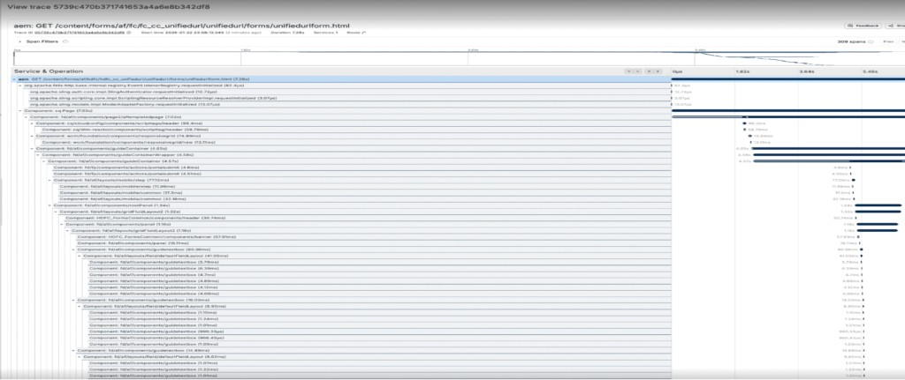
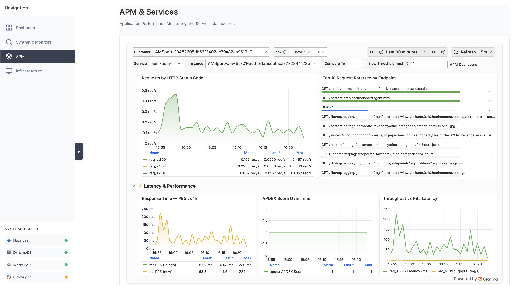
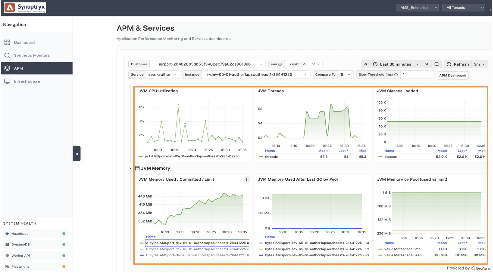
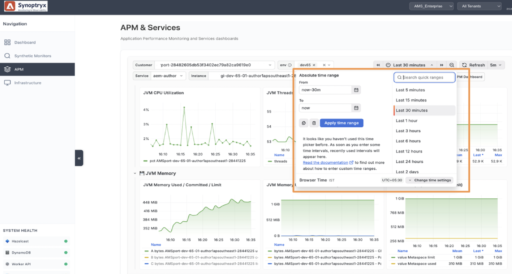
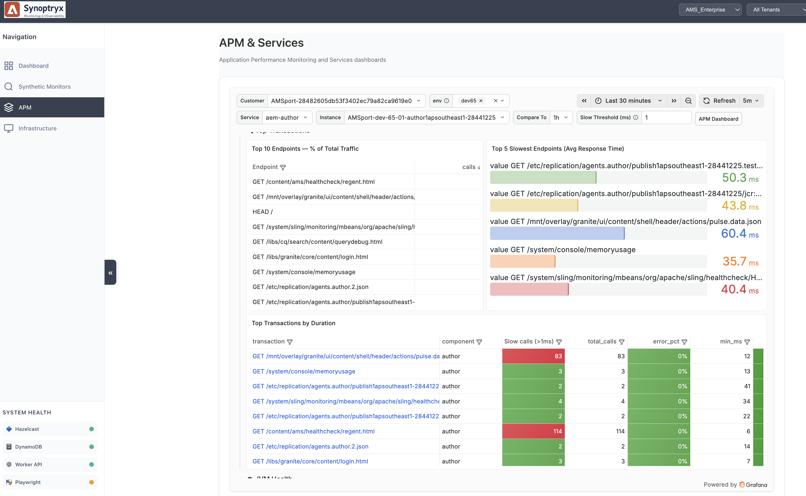
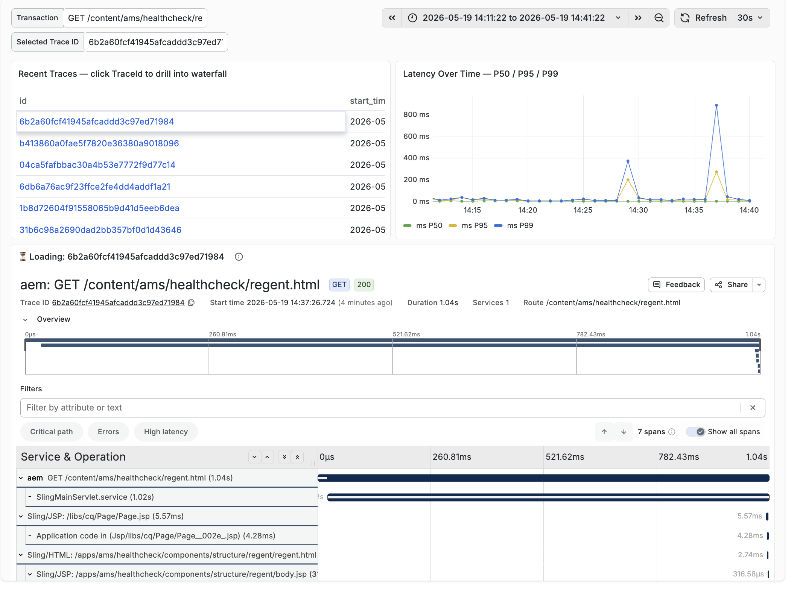
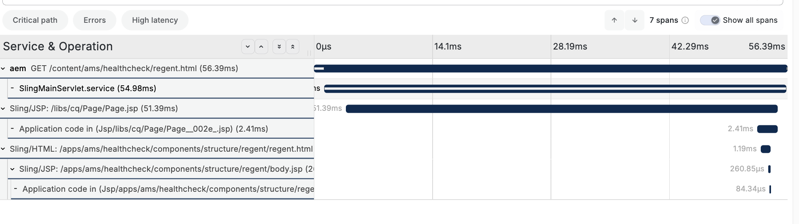
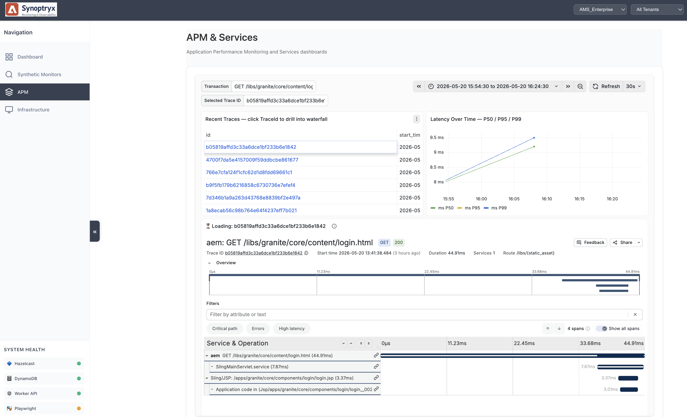

# Application Performance Monitoring (APM) with Synoptryx {#application-performance-monitoring}

Synoptryx Application Performance Monitoring (APM) provides real-time and historical insight into Adobe Experience Manager (AEM) performance and end-user experience. End-to-end transaction tracing, charts, and reports give visibility into application behavior down to the Java code level.

## Managed Services Synoptryx APM plug-in {#apm-plugin}

AEM runs as a Java application on Jetty with Apache Felix OSGi modules, built on Apache Sling and Jackrabbit Oak. Adobe Managed Services, AEM Engineering, and Synoptryx Engineering jointly developed custom instrumentation for Managed Services environments.

That instrumentation collects:

* **Meaningful transaction naming** — Sling extensions align transaction names with page structure and add a `requestURL` attribute on Insights events so you can correlate Sling URLs across dashboards.

* **JCR instrumentation** — Repository-level operations (including XPath and JCR-SQL2) are categorized and attached to transaction traces in the database section of APM.

## Using Synoptryx APM {#using-apm}

Use APM to find application issues before they affect end-users. Author and Publish share a codebase but are monitored as **separate APM applications** so you can analyze each tier independently.

Every Managed Services environment includes:

* One APM application for Author
* One APM application for Publish

Select an application name in Synoptryx APM to open its overview and monitoring dashboard.

### Overview dashboard {#apm-overview}

The Overview page shows real-time and historical KPIs: memory, CPU, database queries, browser metrics, availability, errors, external services, and more.

* **Transaction response time** — See where time is spent (queues, rendering, external calls). Web transactions cover browser activity; non-web transactions cover jobs, batch work, and background processing.
* **Transaction traces** — Find the slowest transactions and inspect detailed traces.
* **Error rate and throughput** — Correlate error spikes with throughput changes (for example, after deployments or outages). Hover charts for point-in-time values.
* **Hosts** — Review CPU, memory, and throughput per host, including Apdex per host, to validate load balancing and spot contention on Publish nodes.
* **Apdex** — Industry-standard satisfaction scoring (Excellent through Frustrated). A score of 1.0 indicates excellent experience.

Start with top transactions (slowest, highest throughput, lowest Apdex), then drill into traces that break requests into execution segments.

Graph legends are interactive—select a series under a chart to show or hide metrics and focus on what matters for your investigation.

### JVM monitoring {#jvm-monitoring}

Because AEM is Java-based, JVM monitoring is essential for stability and performance tuning. Synoptryx tracks heap and non-heap memory, garbage collection (GC) pauses, thread counts and states, JVM CPU, uptime, class loading, and indicators that may suggest memory leaks.

Under healthy conditions, memory graphs show a regular rise and fall from allocation and GC. A steady upward trend without recovery may indicate a memory leak. Thread charts help surface contention or abnormal growth.

Use the **time picker** to change the chart interval.

By default, data is aggregated across all JVMs. Use the **JVMs** dropdown to focus on one instance. Author tiers usually have a single JVM; Publish tiers often have several.

### Transactions {#transactions}

The Transactions view highlights the top five transactions by application server processing time and supports deeper drill-down.

You can analyze transactions by:

* Most time-consuming and slowest average response time
* Lowest Apdex (most dissatisfying)
* Highest throughput and top web transactions
* Throughput charts, breakdown tables, and detailed traces

Use the **Type** dropdown to filter transaction categories, including custom categories for AEM Workflow jobs.

Select a transaction for detailed charts. Move along the timeline for time-specific values and toggle legend items to isolate components. The **Breakdown** table shows where processing time is spent in the transaction lifecycle.

### Transaction traces and external services {#traces-external}

Transaction Traces capture behavior that deviates from normal patterns. Synoptryx analyzes a rolling **30-day** history and recalculates baselines daily. Transactions outside the expected range are flagged automatically.

Open a trace for a summary and method-by-method execution detail. Use the magnifying glass to view stack traces when you need execution-path visibility.

The **External Services** section lists calls outside the current application (and outside Adobe). Select a service to see response time, throughput, and time by caller—useful when third-party or integration latency affects AEM performance.

## What's next {#whats-next}

* [Infrastructure monitoring](infrastructure-monitoring.md) — Review host-level system, network, process, and storage metrics.
