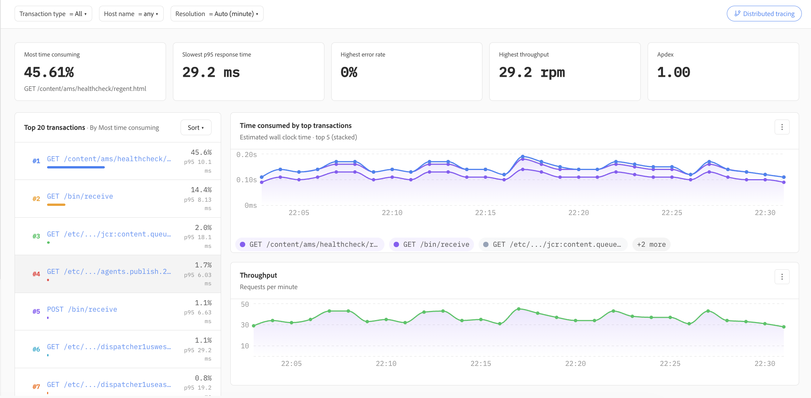

# Applications

Applications provides Application Performance Monitoring (APM) capabilities, offering a unified view of application health, performance, transactions, and the underlying infrastructure supporting each service. It helps operations and engineering teams understand application behavior, identify performance bottlenecks, and move from high-level health indicators to individual transactions for deeper investigation.

## Application summary

The **APM & Services** summary provides an at-a-glance view of the selected application. Key indicators such as p95 latency, server throughput, error rate, and Apdex make it easy to assess application health over the selected time range.

Filters for transaction type, host, and resolution allow the view to be refined for a specific investigation. Response-time and throughput trends provide additional context, helping teams distinguish isolated spikes from sustained performance changes.

## Response time, throughput, and Apdex

Application performance can be evaluated using percentile response times alongside request throughput. Viewing p50, p95, and p99 latency together helps distinguish typical user experiences from slower outliers.

Apdex provides a complementary measure of application responsiveness by translating response-time performance into an easy-to-understand satisfaction score. Together with the error rate, these metrics provide a concise indication of whether an application is operating within expected performance levels.

## Errors and slow transactions

APM continuously surfaces error-rate trends and slow transactions to help identify requests that may be affecting application performance. The error-rate view makes it easy to recognize changes over time, while the Apdex trend shows the corresponding impact on application responsiveness.

The **Slowest transactions** view highlights transactions with the highest average duration and includes call volume, making it easier to distinguish frequently executed workloads from isolated slow requests.

## Transaction and infrastructure correlation

The transaction listing provides a focused view of the slowest transaction types, including their slowest observed trace, error rate, and average duration. This helps teams quickly identify transaction patterns that warrant further investigation.

Application data is correlated with the underlying hosts so that transaction performance can be evaluated alongside infrastructure indicators such as response time, throughput, CPU utilization, and memory utilization. This correlation helps determine whether a performance issue originates in application processing or may be associated with the supporting infrastructure.

## Transaction performance analysis

The transaction analysis view ranks transactions by performance characteristics and summarizes key indicators such as the most time-consuming transaction, slowest p95 response time, highest error rate, throughput, and Apdex.

Time-series visualizations show how the most significant transactions contribute to overall processing time and how request throughput changes over the selected period. This makes it easier to identify high-impact endpoints, compare transaction behavior, and determine which requests should be investigated first.

## Investigating performance issues

APM supports a progressive investigation workflow: begin with application-level health and performance indicators, identify abnormal response times, errors, or throughput changes, and then narrow the investigation to the transactions contributing most to the issue. Transaction data can be correlated with host-level infrastructure metrics.

This workflow helps teams move efficiently from **application health → performance trend → transaction → infrastructure**, reducing the time required to isolate the source of a performance problem.
