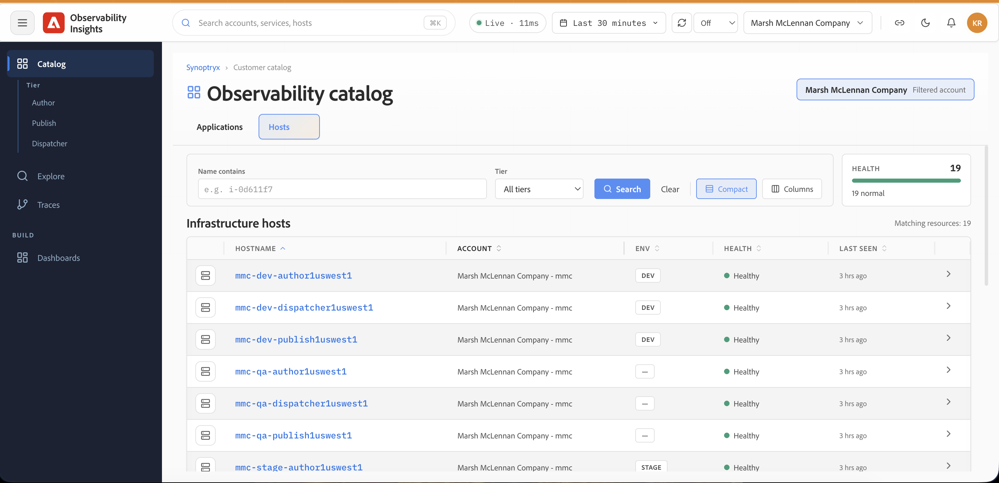
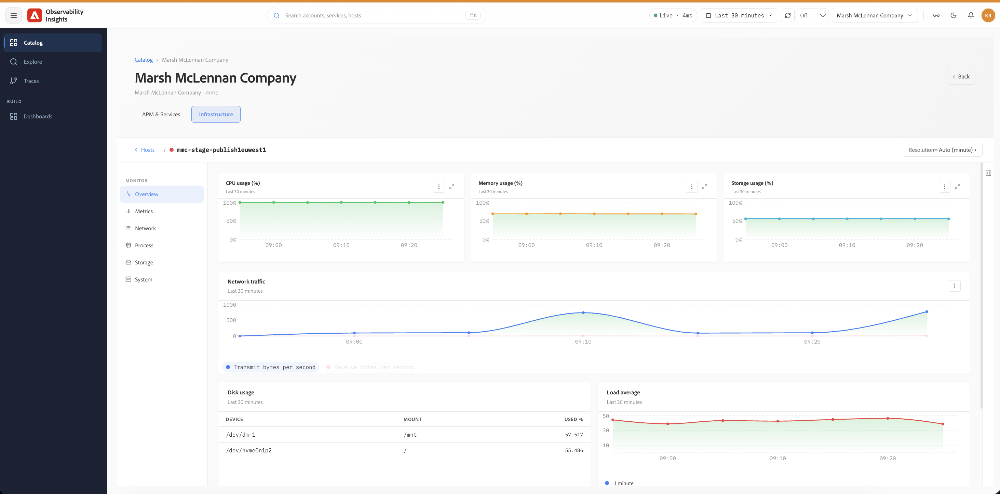

# Hosts {#infrastructure-monitoring}

Use Hosts in Observability Insights to monitor the health, performance, and resource utilization of the infrastructure supporting your applications and services. Use the infrastructure dashboards to identify issues related to host capacity, storage pressure, network throughput, or operating system resource contention.

## What infrastructure monitoring helps you answer {#what-infrastructure-monitoring-helps-you-answer}

Infrastructure monitoring is most useful when you need to answer questions such as:

- Is the application slowdown accompanied by CPU, memory, or I/O pressure?
- Is one host behaving differently from others in the same environment?
- Are network or disk patterns changing during the same interval as a customer-facing incident?
- Are storage utilization trends pointing to an upcoming capacity problem?

## Accessing Infrastructure Hosts {#infrastructure-host-overview}

Infrastructure Monitoring provides host-level visibility into the health and performance of the infrastructure supporting your managed AEM environments. From the **Observability Catalog**, you can browse infrastructure hosts and drill into an individual host to investigate CPU, memory, network, storage, and other system-level signals.

## Accessing Infrastructure Hosts

From **Catalog**, select the **Hosts** tab to view the infrastructure associated with the selected account.

The **Infrastructure hosts** view provides an inventory of monitored hosts and includes:

- **Hostname** — Name of the monitored infrastructure host.
- **Account** — Account associated with the host.
- **Environment** — Environment classification, such as `DEV` or `STAGE`.
- **Health** — Current health status of the host.
- **Last seen** — How recently telemetry was received from the host.

## Suggested investigation flow {#suggested-investigation-flow}

For most incidents, review the host dashboard in this order:

1. Check CPU utilization, load average, and memory usage for obvious saturation.
2. Review CPU I/O wait and disk throughput if response times increase without a matching CPU spike.
3. Compare network throughput with application traffic to identify load-related shifts.
4. Check storage usage and filesystem-level disk usage for persistent capacity risk.
5. Compare multiple hosts to see whether the issue is localized or systemic.

## What to review first {#what-to-review-first}

- **CPU and memory** when an application appears slow or unstable across a broader time range.
- **Disk I/O and CPU I/O wait** when requests stall or queue unexpectedly.
- **Network I/O** when traffic characteristics change or downstream dependencies are suspected.
- **Storage usage** when incidents involve deployment failures, indexing pressure, or long-term capacity concerns.

Use the **Name contains** field and **Tier** filter to narrow the list of hosts. Select a hostname to open its infrastructure monitoring details.

## Host Monitoring

After selecting a host, the **Infrastructure** view provides dedicated monitoring pages for that host.

The host navigation includes:

- **Overview** — Consolidated view of key infrastructure health and utilization signals.
- **Metrics** — Detailed host performance metrics, including CPU, memory, load, disk I/O, and network throughput.
- **Network** — Network traffic, interface activity, and transmit/receive errors.
- **Process** — Host process-level monitoring.
- **Storage** — Disk utilization, disk I/O, and filesystem usage.
- **System** — Core system resource metrics such as CPU, memory, and load average.

## Questions to answer during investigation {#questions-to-answer}

- Is the issue isolated to one host or visible across the environment?
- Are CPU, memory, or disk signals elevated during the same window as the incident?
- Is storage growth trending toward a threshold that could affect operations?
- Do infrastructure symptoms explain the application behavior, or do they only appear as a downstream effect?

## Evidence to capture when escalating {#evidence-to-capture}

- Affected environment and hosts
- Time window of the issue
- CPU, memory, disk, and network screenshots
- Whether the anomaly is isolated or systemic
- Related application symptoms from APM
