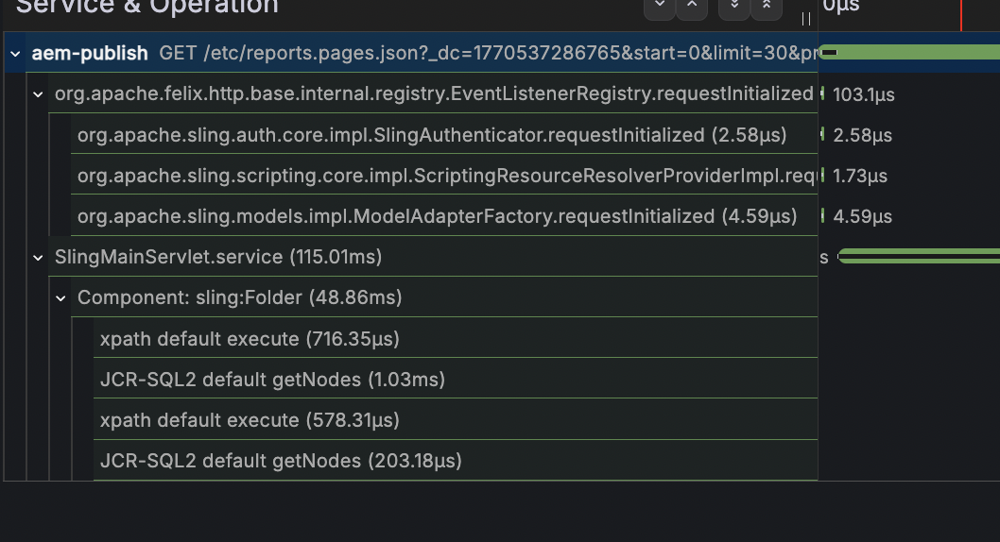
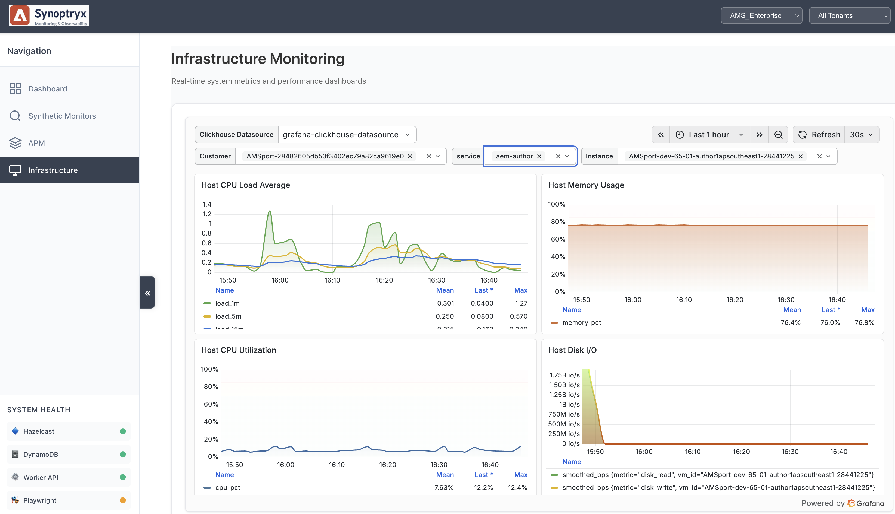
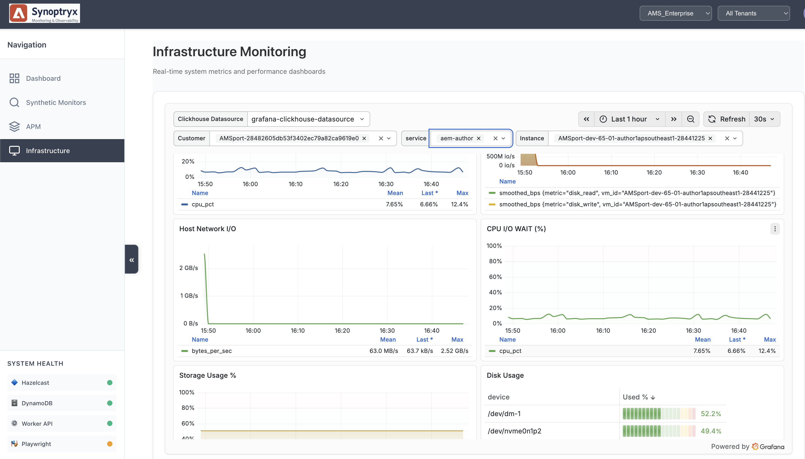
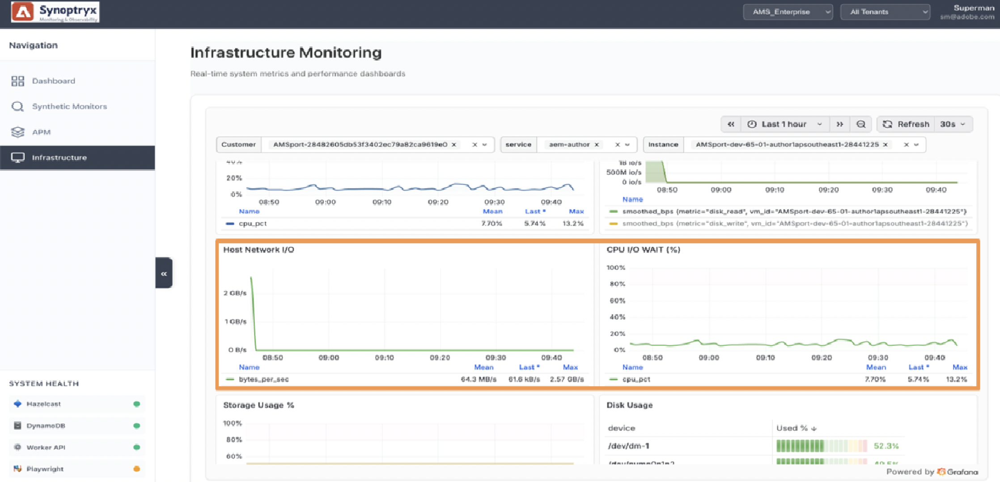
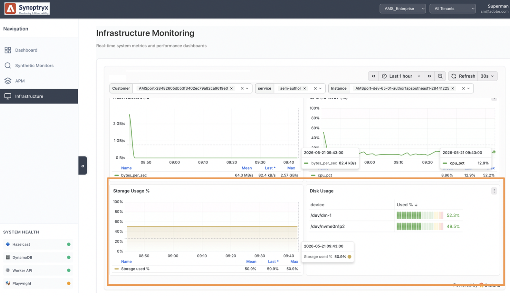

# Infrastructure Monitoring with Synoptryx {#infrastructure-monitoring}

Synoptryx Infrastructure monitors Author, Publish, Dispatcher, and other hosts in your Adobe Experience Manager (AEM) Managed Services footprint. Host data is centralized so you can compare systems and investigate issues efficiently.

## Infrastructure Monitoring {#infrastructure}

* **Inventory** — Current status and inventory of monitored systems
* **Events feed** — Logins, upgrades, and other infrastructure events
* **Hosts** — CPU, memory, network, processes, and disk metrics; filter and compare hosts to find bottlenecks

Each host provides tabs for System, Network, Processes, and Storage.

### System {#infra-system}

The System tab shows default performance graphs; use chart dropdowns to add more views. Key metrics include:

|Metric|Description|
|---|---|
|CPU %|Derived from `cpuUserPercent`, `cpuSystemPercent`, `cpuIoWaitPercent`, and `cpuStealPercent`|
|Load average (5 min)|Tasks waiting for CPU|
|Memory used %|Used compared to free memory|
|Host disk I/O|Data transfer between RAM and storage|

### Network {#infra-network}

Monitor bandwidth (packets and bytes), errors per second, and the health of hosts and network resources. Use this tab to spot throughput issues or interface errors.

### Processes {#infra-processes}

Review per-process CPU, I/O bytes, and memory across your hosts.

Process-level CPU reflects use of a *single* core per process, not total system CPU—helpful when isolating a specific daemon or service.

### Storage {#infra-storage}

Track device utilization, disk usage, I/O operations, and storage efficiency to catch capacity or performance issues early.

## Summary {#conclusion}

Synoptryx is part of the standard AEM Managed Services offering. It brings together application and infrastructure monitoring so your team can understand performance, troubleshoot faster, and work with Adobe using a shared view of your environment.

For access requests, questions about your account, or help interpreting metrics, contact your Customer Success Engineer.
