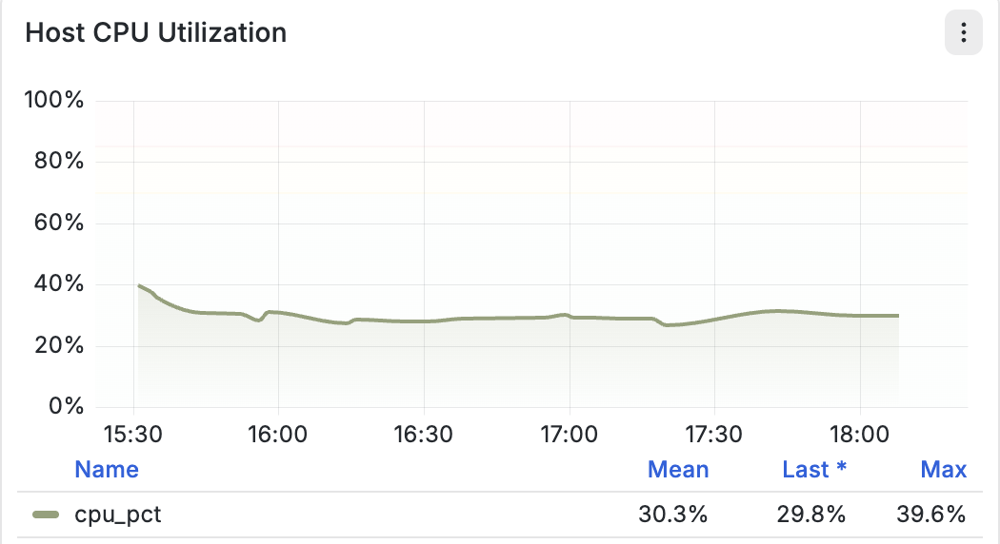
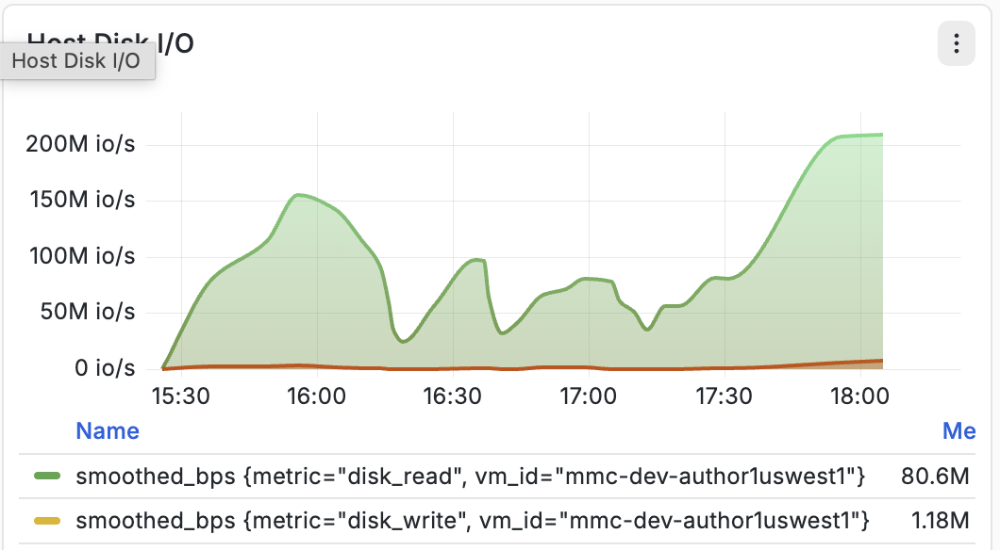
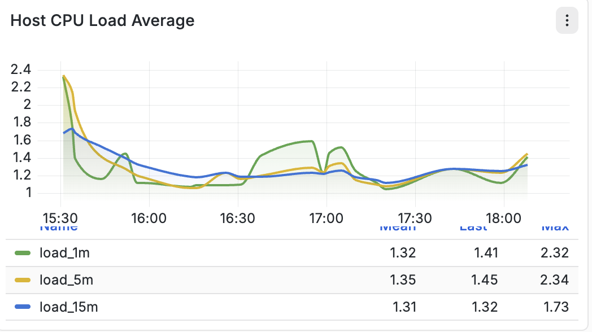

# Infrastructure dashboard reference {#infrastructure-dashboard-reference}

This reference documents the host-level infrastructure panels used in Synoptryx for AEM Managed Services.

## Dashboard overview

The Host Infrastructure Monitoring Dashboard provides real-time visibility into the utilization and performance of the underlying host. These metrics assist operators in monitoring compute, memory, storage, and network resources while identifying potential resource bottlenecks.

The dashboard includes the following monitoring panels:

- Host CPU Utilization
- Host Disk I/O
- Host Network I/O
- CPU I/O Wait
- Storage Usage
- Disk Usage
- Host CPU Load Average
- Host Memory Usage

## 1. Host CPU Utilization

### Description

The **Host CPU Utilization** panel displays the percentage of CPU resources currently being consumed by the operating system and all running processes over time.

This metric represents the overall CPU usage across the host and provides a time-series visualization of processor activity.

The graph allows operators to monitor how CPU consumption changes during the selected observation window.

### Metric

| Metric    | Description                              |
| --------- | ---------------------------------------- |
| `cpu_pct` | Percentage of total CPU currently in use |

### Units

- Percentage (%)

### Displayed Statistics

The panel summarizes CPU utilization using three values:

| Statistic | Description                                                     |
| --------- | --------------------------------------------------------------- |
| Mean      | Average CPU utilization during the selected time range          |
| Last      | Most recently collected CPU utilization value                   |
| Max       | Highest CPU utilization observed during the selected time range |

### Graph Components

- Time-series line representing CPU utilization.
- Percentage-based Y-axis ranging from **0% to 100%**.
- Summary statistics displayed below the graph.
- Historical trend across the selected monitoring interval.

## 2. Host Disk I/O

### Description

The **Host Disk I/O** panel displays storage throughput for disk read and disk write operations performed by the host.

The graph presents two independent time-series that represent data being transferred between the operating system and storage devices.

This visualization helps monitor storage activity over time and provides insight into the volume of data being read from and written to disks.

### Metrics

| Metric       | Description                       |
| ------------ | --------------------------------- |
| `disk_read`  | Amount of data read from storage  |
| `disk_write` | Amount of data written to storage |

Internally, these metrics are displayed using smoothed throughput values.

### Units

- Bytes per second (B/s)
- Kilobytes per second (KB/s)
- Megabytes per second (MB/s)
- Gigabytes per second (GB/s)

The displayed unit automatically scales based on throughput.

### Graph Components

- Green line representing disk read throughput.
- Orange line representing disk write throughput.
- Time-series visualization.
- Separate legend for each metric.
- Current metric values displayed beside each series.

## 3. Host Network I/O

### Description

The **Host Network I/O** panel displays the volume of network traffic transmitted and received by the host over time.

The graph measures the rate at which data flows through the network interfaces and provides visibility into network bandwidth consumption.
This metric represents aggregate network throughput.

### Metric

| Metric          | Description                                                           |
| --------------- | --------------------------------------------------------------------- |
| `bytes_per_sec` | Aggregate network throughput measured as bytes transferred per second |

### Units

The graph automatically scales between:

- Bytes/sec
- KB/sec
- MB/sec
- GB/sec

depending on the observed traffic volume.

### Displayed Statistics

| Statistic | Description                        |
| --------- | ---------------------------------- |
| Mean      | Average network throughput         |
| Last      | Most recent throughput measurement |
| Max       | Highest throughput observed        |

### Graph Components

- Single throughput line.
- Time-series visualization.
- Dynamic bandwidth scaling.
- Summary statistics displayed beneath the chart.

## 4. CPU I/O Wait

### Description

The **CPU I/O Wait** panel displays the percentage of CPU time spent waiting for input/output operations to complete.

This metric represents processor idle time that occurs because active processes are blocked while waiting for storage devices or other I/O operations.

The graph visualizes how I/O wait changes over time.

### Metric

| Metric    | Description                                            |
| --------- | ------------------------------------------------------ |
| `cpu_pct` | Percentage of CPU time spent waiting on I/O operations |

### Units

- Percentage (%)

### Displayed Statistics

| Statistic | Description                     |
| --------- | ------------------------------- |
| Mean      | Average CPU I/O wait percentage |
| Last      | Most recently recorded value    |
| Max       | Highest recorded value          |

### Graph Components

- Time-series line.
- Percentage-based Y-axis.
- Summary statistics.
- Historical trend visualization.

## 5. Storage Usage

### Description

The **Storage Usage** panel displays the overall percentage of storage capacity currently utilized on the monitored host.

The graph provides a historical view of filesystem capacity utilization during the selected time interval.

### Metric

| Metric          | Description                                        |
| --------------- | -------------------------------------------------- |
| Storage Usage % | Percentage of allocated storage currently consumed |

### Units

- Percentage (%)

### Graph Components

- Time-series utilization graph.
- Percentage scale.
- Historical storage utilization trend.

## 6. Disk Usage

### Description

The **Disk Usage** panel displays storage utilization for each mounted filesystem or storage device.

Each row corresponds to a specific block device or mounted partition and reports the percentage of space currently in use.

This table provides a filesystem-level breakdown of storage utilization.

### Displayed Information

Each entry includes:

| Field           | Description                                  |
| --------------- | -------------------------------------------- |
| Device          | Mounted storage device or filesystem         |
| Used %          | Percentage of utilized storage capacity      |
| Utilization Bar | Visual representation of storage consumption |

### Units

- Percentage (%)

### Graph Components

- Filesystem/device listing.
- Utilization percentage.
- Color-coded capacity indicator.
- Sorted utilization values.

## 7. Host CPU Load Average

### Description

The **Host CPU Load Average** panel displays the Linux system load averages over three rolling time windows.

Unlike CPU utilization, load average represents the average number of processes that are either actively running or waiting for CPU scheduling or I/O completion.

The graph simultaneously displays three rolling averages that provide short-term and long-term workload trends.

### Metrics

| Metric     | Description                                  |
| ---------- | -------------------------------------------- |
| `load_1m`  | Average system load over the last 1 minute   |
| `load_5m`  | Average system load over the last 5 minutes  |
| `load_15m` | Average system load over the last 15 minutes |

### Units

- Load Average (dimensionless value)

### Displayed Statistics

For each load average metric:

| Statistic | Description                             |
| --------- | --------------------------------------- |
| Mean      | Average load during selected time range |
| Last      | Latest recorded load value              |
| Max       | Highest observed load value             |

### Graph Components

- Three independent trend lines.
- Time-series visualization.
- Individual legends for each rolling average.
- Summary statistics for each metric.

## 8. Host Memory Usage

### Description

The **Host Memory Usage** panel displays the percentage of physical system memory currently allocated by the operating system.

This metric represents overall RAM utilization across all running processes, kernel memory, buffers, and caches.

The graph provides a continuous view of memory consumption throughout the selected monitoring period.

### Metric

| Metric       | Description                                    |
| ------------ | ---------------------------------------------- |
| `memory_pct` | Percentage of physical memory currently in use |

### Units

- Percentage (%)

### Displayed Statistics

| Statistic | Description                        |
| --------- | ---------------------------------- |
| Mean      | Average memory utilization         |
| Last      | Most recently recorded utilization |
| Max       | Highest utilization observed       |

### Graph Components

- Time-series memory utilization graph.
- Percentage-based Y-axis.
- Historical utilization trend.
- Summary statistics.

## Summary of dashboard metrics

| Dashboard Panel       | Primary Metric                   | Unit         |
| --------------------- | -------------------------------- | ------------ |
| Host CPU Utilization  | `cpu_pct`                        | %            |
| Host Disk I/O         | `disk_read`, `disk_write`        | Bytes/sec    |
| Host Network I/O      | `bytes_per_sec`                  | Bytes/sec    |
| CPU I/O Wait          | `cpu_pct`                        | %            |
| Storage Usage         | Storage Usage %                  | %            |
| Disk Usage            | Filesystem Usage                 | %            |
| Host CPU Load Average | `load_1m`, `load_5m`, `load_15m` | Load Average |
| Host Memory Usage     | `memory_pct`                     | %            |
