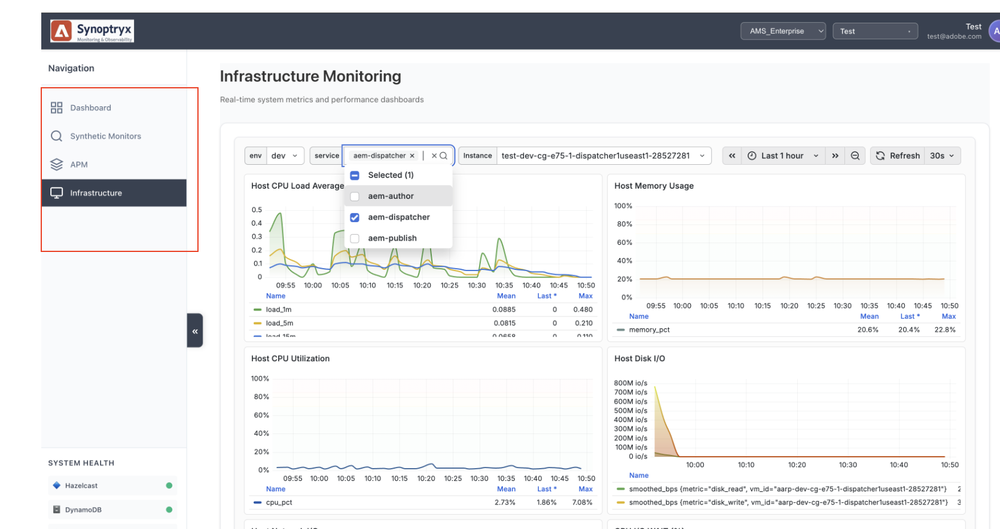

# Use Synoptryx {#use-synoptryx}

This section covers the day-to-day monitoring and investigation workflows your team uses most, organized around two monitoring areas: Application Performance Monitoring and Infrastructure monitoring.

## The Synoptryx interface {#synoptryx-interface}

The Synoptryx left navigation panel gives you access to all monitoring areas for your AEM Managed Services environments.

The navigation includes:

- **APM** — Application performance data for your Author and Publish tiers. Covers request throughput, error rates, latency, JVM behavior, and transaction traces.
- **Infrastructure** — Host-level health data for all servers in your managed topology. Covers CPU, memory, disk, network, and storage signals, with filters for individual hosts or environment groups (such as aem-author, aem-dispatcher, aem-publish).

Both areas are read-only for customer users. Adobe Managed Services manages account provisioning, instrumentation, and administrative control.

## Application Performance Monitoring {#application-performance-monitoring}

Use [Application Performance Monitoring (APM)](application-performance-monitoring.md) when the issue is application-facing — slow pages, rising error rates, unstable transactions, or unexpected latency on Author or Publish.

APM helps you answer:

- Is the issue isolated to Author, Publish, or affecting both tiers?
- Which endpoints or transactions contribute most to traffic and slowdowns?
- Did latency or errors change before or after a deployment or traffic spike?
- Do traces point to repository operations, external dependencies, or JVM pressure?

APM instruments AEM transactions down to method calls, external dependencies, and repository operations, so you can move quickly from a broad symptom to a specific execution path.

## Infrastructure monitoring {#infrastructure-monitoring}

Use [Infrastructure monitoring](infrastructure-monitoring.md) when you need to determine whether application behavior is caused or compounded by host resource conditions — CPU saturation, memory pressure, disk I/O, network throughput, or storage capacity.

Infrastructure monitoring helps you answer:

- Is the application slowdown accompanied by CPU, memory, or I/O pressure at the host level?
- Is one host behaving differently from others in the same environment?
- Are disk or storage utilization trends pointing to an upcoming capacity problem?
- Do infrastructure patterns explain the application behavior, or are they a downstream effect?

Use infrastructure dashboards alongside APM to distinguish between application-level regressions and environment-level resource constraints.

Both articles include investigation workflows, questions to guide your triage, and a list of evidence to capture when escalating to Adobe Managed Services.
